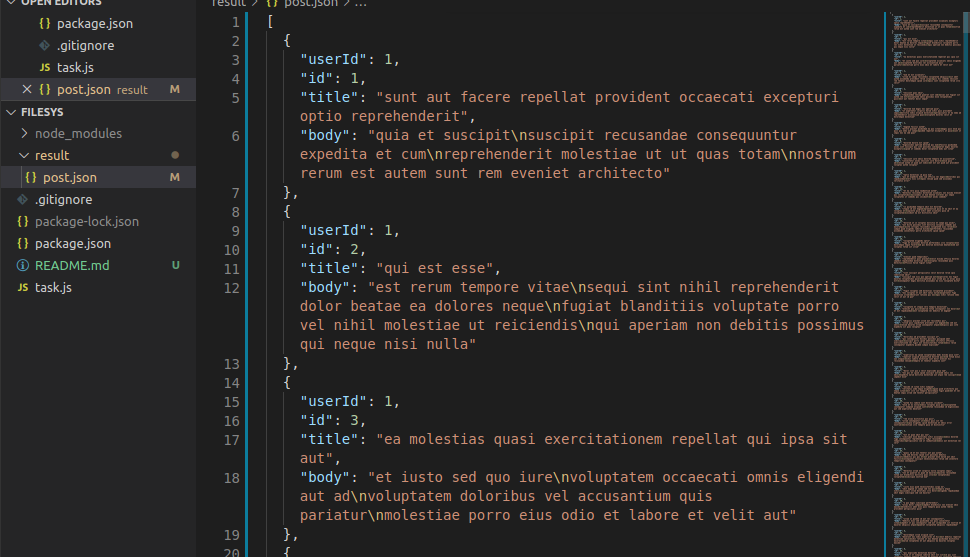

 

  

## NodeJS File System Task 
1. Create a script file that fetches data from JSON PLACEHOLDER POSTS
2. Write the JSON data gotten from the API to a file called posts.json or posts.txt
3. posts.json or post.txt should be in a directory file called result.
4. Create a github repository and push your work.

### Technologies Used
- [Nodejs](https://nodejs.org/en/)
- [node-fetch](https://github.com/node-fetch/node-fetch)

### How to Install and run the application
- Clone/Fork the application
- Run `npm install`
- Run `node task` to display the result.

The output can be found in ./result/post.json

## ScreenShoots
